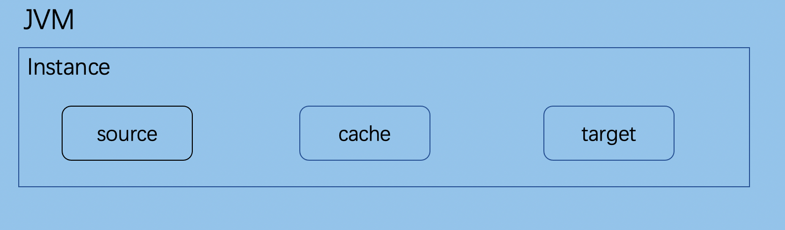

## 背景

为解决异构关系型数据库之间的数据迁移，以及向国产数据库（达梦、TiDB、人大金仓等）转型的需求，关系型同步产品在本仓库演进为 **rds-sync**。

## 项目介绍

名称：rds-sync

语言：纯 Java

定位：关系型数据库同步（MySQL / Oracle / PostgreSQL 源；Sink 为 MySQL JDBC 或 Kafka，见 [ARCHITECTURE.md](ARCHITECTURE.md)）

> MongoDB 同步请使用 [mongo-sync](https://github.com/whaleal-dev/mongo-sync)。本仓不再包含 Mongo 模块；控制 API 对齐，见 [ARCHITECTURE.md](ARCHITECTURE.md)。

## 能力范围

1. 全量迁移  
2. 增量迁移（CDC，规划中）  
3. 嵌入式 SDK 编排（规划中，见 [ARCHITECTURE.md](ARCHITECTURE.md)）

## 架构

详见 [ARCHITECTURE.md](ARCHITECTURE.md)。

架构示意：

**说明:**

1. 一个 JVM Container 可对应多个 instance，每个 instance 对应一个迁移程序  
2. instance 分为三部分：a. source（全量/增量提取） b. cache（缓存） c. sink（写入）

## 联系方式

欢迎任何形式的贡献，包括但不限于：提交问题、提供用户体验反馈、代码贡献等。
